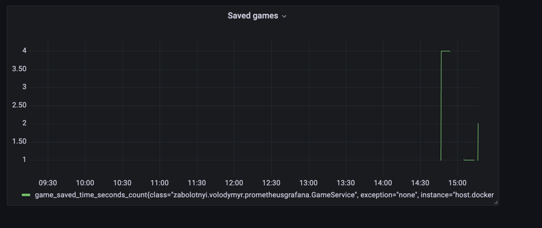

# To run
1. Start prometheus and grafana
```bash
docker-compose up -d
```
2. Run application 
```bash
mvn spring-boot:run
```
3. Run
```bash
 curl -X POST --location "http://127.0.0.1:8181/games/post" 
```
4. Open prometheus: http://localhost:9090
5. Check metrics "game_saved_time"
6. Open grafana: http://localhost:3000
7. Add new data source 
   1. Add prometheus url: http://host.docker.internal:9090
   2. Save and test
8. Add new dashboard: http://localhost:3000/dashboard/new

